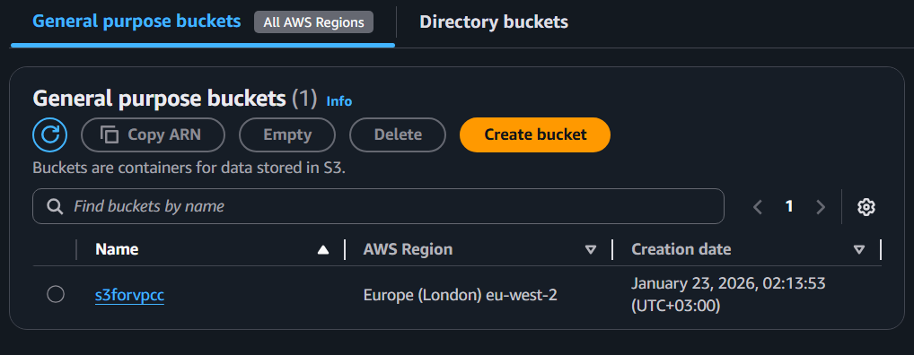
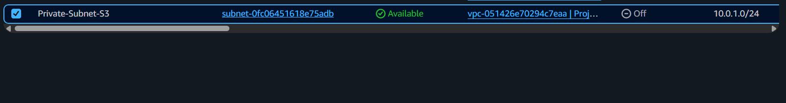
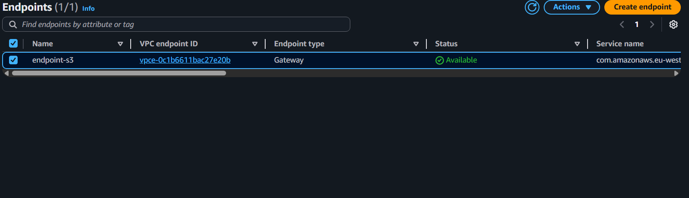

# AWS-Secure-Cost-Optimized-S3-Connectivity
Bu proje, AWS üzerinde internet erişimi olmayan (private) bir ağ içerisinden Amazon S3 servislerine güvenli ve ücretsiz bir şekilde nasıl erişilebileceğini gösteren bir **Solution Architecture** çalışmasıdır.

## Mimari Tasarım
Sistem, aşağıdaki bileşenlerden oluşmaktadır:
- **VPC:** 10.0.0.0/16 CIDR bloğuna sahip izole ağ.
- **Private Subnet:** Dış dünyaya (Internet Gateway) kapalı alt ağ.
- **S3 Gateway Endpoint:** Trafiği AWS backbone ağı üzerinden S3'e taşıyan tünel.

## Neden Bu Mimariyi Seçtim? (Architectural Decisions)

### 1. Güvenlik (Security)
Sunucuların internet erişimi tamamen kapatılmıştır. Bu sayede "Attack Surface" (Saldırı Yüzeyi) minimize edilmiştir. Veri transferi halka açık internete hiç çıkmadan AWS iç ağında gerçekleşir.

### 2. Maliyet Optimizasyonu (Cost Optimization)
Genellikle izole ağlar için kullanılan **NAT Gateway** servisinin saatlik maliyeti ve veri işleme ücreti vardır. **VPC Gateway Endpoint** kullanımı ise tamamen **ücretsizdir**. Bu seçim, kurumsal bir yapıda yıllık bazda ciddi tasarruf sağlar.

### 3. Performans
Trafik AWS'nin kendi fiber ağı üzerinden geçtiği için daha düşük gecikme (latency) ve daha yüksek bant genişliği elde edilir.

## Kurulum Adımları
1. London (eu-west-2) bölgesinde bir VPC ve Private Subnet oluşturuldu.
2. S3 üzerinde verilerin depolanacağı bir Bucket hazırlandı.
3. VPC Endpoint menüsünden `com.amazonaws.eu-west-2.s3` (Gateway tipi) oluşturuldu.
4. Route Table üzerinde S3 trafiği bu endpoint'e yönlendirildi.

## Sonuç
Bu çalışma sonucunda, yüksek güvenlikli ve sıfır maliyetli bir veri transfer hattı başarıyla kurulmuştur.

